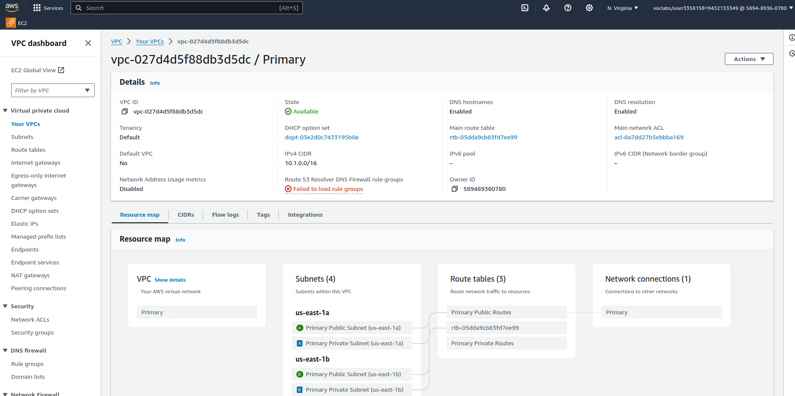
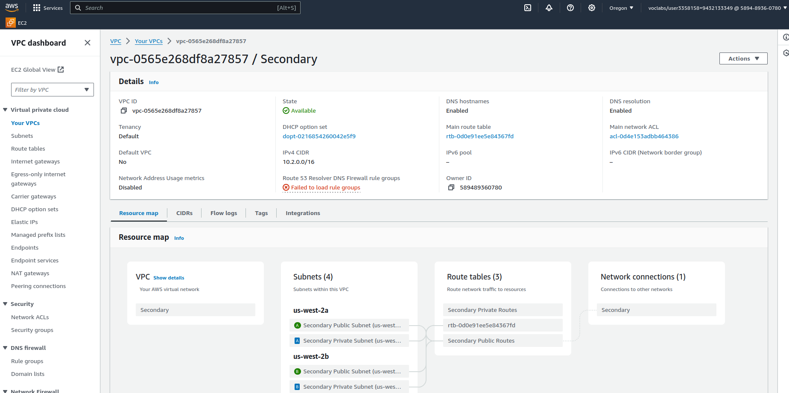
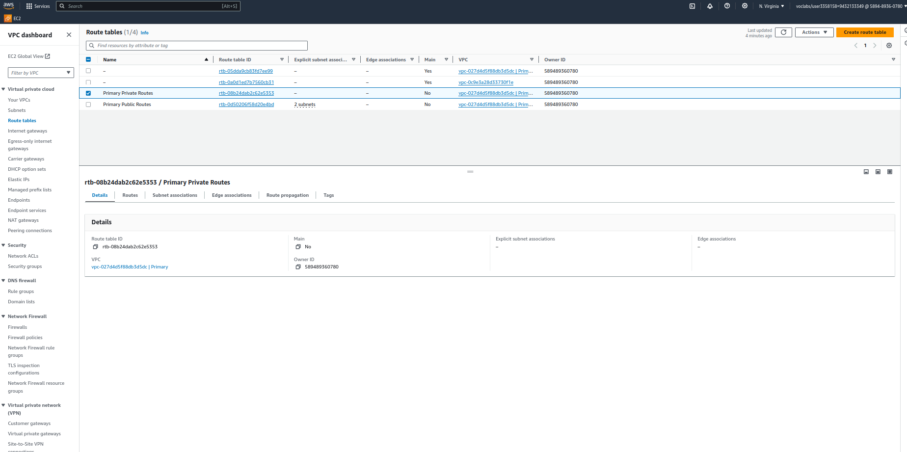
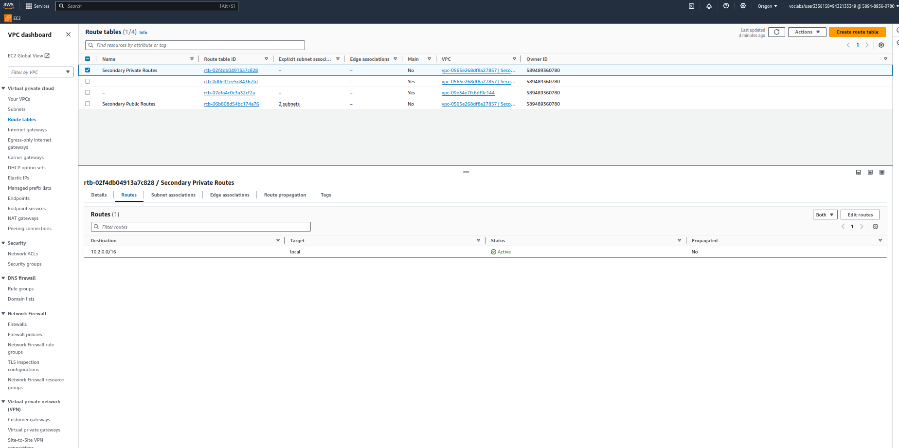
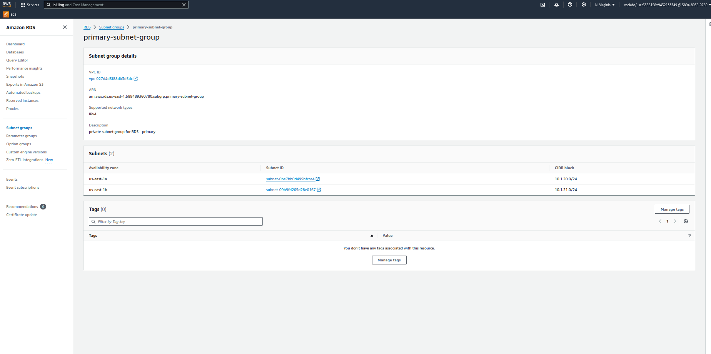
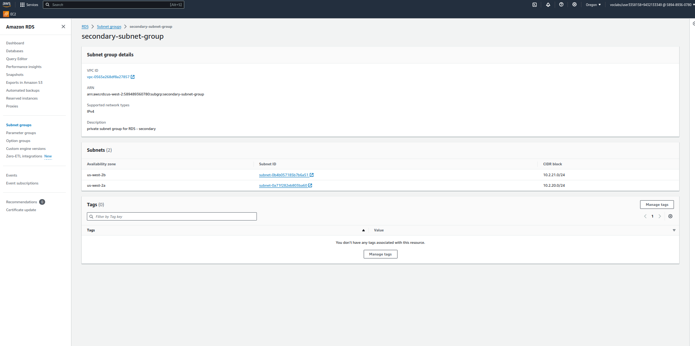
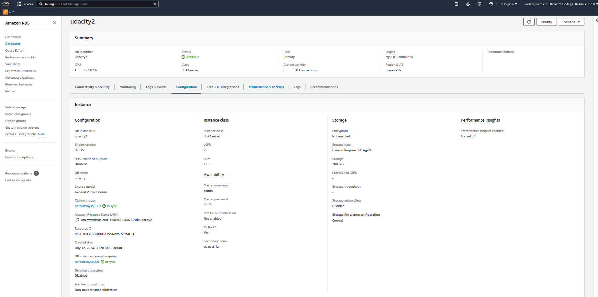
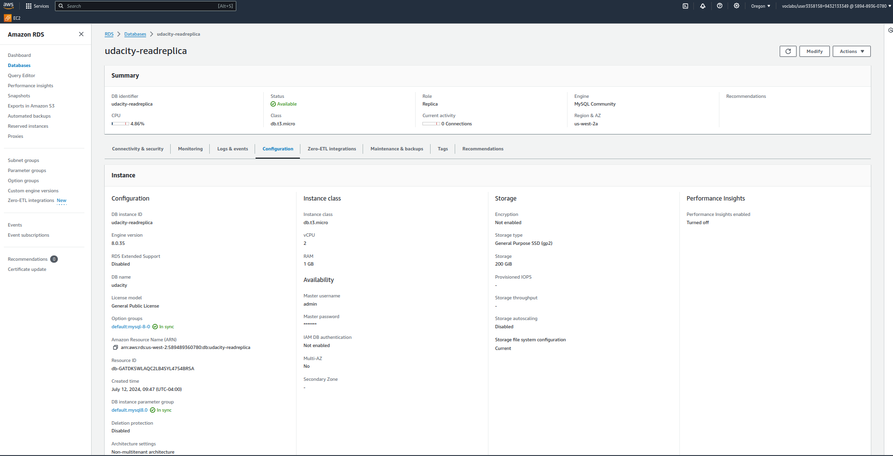
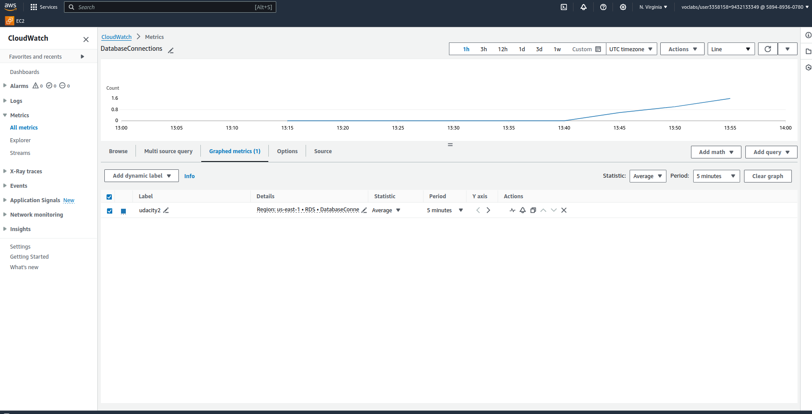
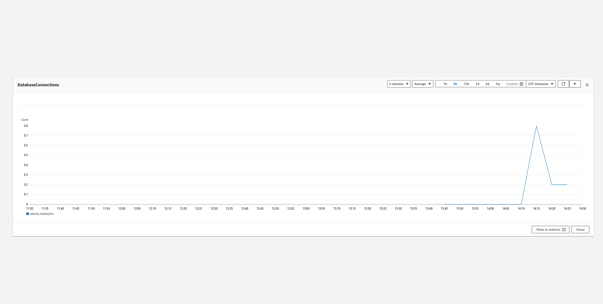

# AWSProject_RecoverabilityInAWS_udacity
Recoverability project for the udacity nanodegree - AWS cloud architect

## Introduction
This project demonstrates the creation of highly available solutions to common use cases, focusing on data durability and recovery using AWS. The project involves building a Multi-Availability Zone, Multi-Region database and a versioned website hosting solution.  I used the AWS Console for most of my work in setting up resources on AWS.  I used SSH to access a jump server and create tables on my database.

## Lessons Learned
- Databases can be expensive.
    For the Udacity project, we were given $25 credit to complete the project.  The first time I set up the database, I was able to ssh into the EC2 then remote into the database server.  I wrote some data, then went to bed thinking that everything up to that point was successful.  I had not paid attention to how much RDS costs to leave up and running.  AWS charges by the hour for RDS.  I came back two days later and found that my account was over balance and that my AWS instance was shut down.  Luckily udacity was kind enough to credit me $15 and reminded me that I needed to shut down everything before I close a session.  I was able to complete the project in a single session and I made sure to delete or deactivate all the resources before logging out.  

-Cloud formation is pretty awesome.  
  I have not used cloud formation before this project.  Setting up infrastructure as code is extremely helpful.  I didn't have to worry about creating all the subnets and fooling with the routing tables. 

- Google and Stack Overflow are your friends (not a new lesson learned. hah!).
    I was able to ssh into my jump server fairly easily, but I was having trouble finding how to connect to the MySQL database.  The mysql command wasn't available on the EC2 instance I had to set up (amazon linux).  I couldn't do an install for mysql either.  I ended up finding some documentation that had you run "sudo dnf install mariadb105".    

## Table of Contents

## Part 1 - Data Durability and Recovery
In this part, I set up the network and established a multi-az RDS database with a read replica in another region

### VPC Setup
To start, I used the provided yml file and used cloud formation to set up the networking in the us-east-1 and us-west-2 regions.  The setup included two private and two public subnets across two availability zones in two different regions.  It was very nice not to have to manually set these up.  Infrastructure as code is awesome (so long as it's set up properly).

### Database Setup
The requirement for the database was to create a multi-az database that would failover into another availability zone and a read replica in another region in case the first region experienced an outage.

The first step to create a multi-az database is to create subnet groupings.  This ensures that your database will failover to the standby in case of outages in the first az.

The database setup was fairly straightforward once the subnets were set up.  It took quite a while for the database to become available.  It first had to spin up the instance, then it had to modify the db to be multi-az.

In order to create the replica, you just needed to select the primary database and click actions -> create read replica.  This was straightforward as well.

### Demonstrating Normal Usage
The requirement here was just to create a table on the database and insert some data.  The tricky part was connecting to the database.  I had to set up a jump server (EC2), SSH into that server, then access the database from there.  The biggest challenge was just getting the mysql command.  I eventually found some help on stack overflow that said to install maria105 using "sudo dnf install mariadb105".  From there, logging into the database, creating the table, and inserting data was a breeze.

You can see the log here: `logs/log_primary.txt`

### Monitoring the Database
Udacity required me to monitor the connections to the databases when I connected to them.  There's nothing really exciting here.  Cloud Watch showed that my connections went up then down.  It's something to watch out for and possibly create alerts for depending on your database needs.

